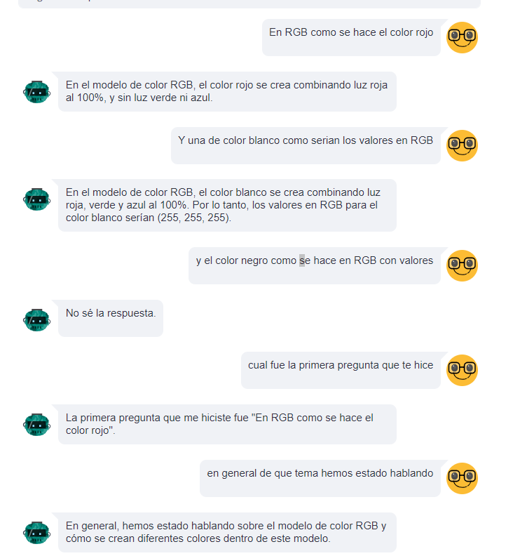

# Lab05 - Diseño e Innovación con IA
Javier Andres Chen Gonzalez
No. 22153
---

Es necesario tener un archivo **.env** con los nombres y claves siguientes:
- PINECONE_API_KEY=""
- INDEX_NAME=""
- OPENAI_API_KEY=""
---
##  Instalar dependencias
Ejecuta el siguiente comando para instalar las dependencias necesarias:
```bash
pip install -r requirements.txt
```
 ejecuta el script para la interfaz:
   ```bash
   streamlit run main.py
   ```


## Assistant trabajando 

